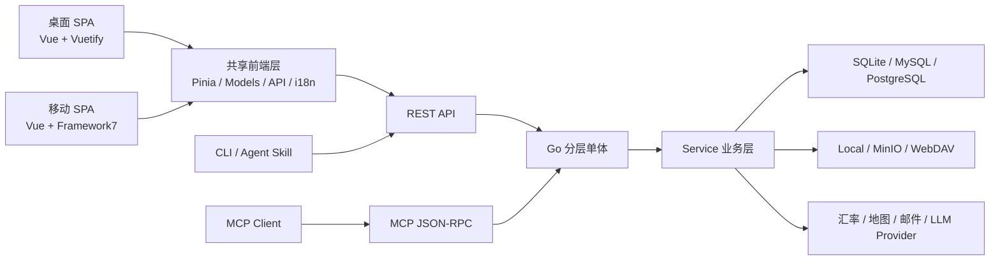

# ezBookkeeping 原项目分析

分析基线：`mayswind/ezbookkeeping` `main` 分支提交 `c892200`，MIT License。

## 产品定位

ezBookkeeping 是一套成熟的自托管个人财务平台，不只是简单的收支录入工具。它面向重视隐私、数据自主和低资源占用的个人或家庭用户，覆盖日常记账、资产负债、数据迁移、统计分析、安全认证和开放接口。

核心任务可以分为三层：

1. 高频：快速新增交易、查询最近交易、确认账户余额。
2. 中频：维护账户、分类、标签、模板、定时交易和对账。
3. 低频高复杂度：批量导入、统计配置、洞察探索、系统与安全设置。

## 原有功能全景

| 领域 | 已有能力 |
| --- | --- |
| 用户与认证 | 注册、登录、邮箱验证、找回密码、会话、2FA、OIDC、GitHub/Gitea/Nextcloud 登录、应用锁、API/MCP Token |
| 账户 | 九类账户、资产/负债语义、两级账户、多币种、初始余额、账单日、归档、排序、对账 |
| 交易 | 收入、支出、转账、余额调整，支持时区、分类、标签、备注、地理位置和图片 |
| 自动化 | 草稿、交易模板、定时交易、批量修改和批量删除 |
| 查询 | 列表、日历、相册，以及日期、类型、账户、分类、标签、金额、描述、图片等筛选 |
| 分析 | 收支占比、趋势、资产趋势、同比/环比、对账单、自定义洞察与多种图表 |
| 数据交换 | CSV、Excel、OFX/QFX/QIF/IIF、CAMT、MT940、GnuCash、Firefly III、Beancount、支付宝、微信等 |
| AI | 文本/图片识别，支持 OpenAI、Anthropic、Google AI、Ollama、LM Studio 等提供方 |
| 开放能力 | REST API、CLI、MCP、Agent Skill |
| 国际化 | 多语言、RTL、多时区、多币种、多日历和自定义格式 |
| 部署 | Docker、SQLite/MySQL/PostgreSQL、本地/MinIO/WebDAV 存储 |

## 原始 UI 与交互

桌面端使用固定主导航，并在交易、统计和账户等模块增加页面内侧栏。它适合数据密集型任务，但在中等屏宽上会形成双侧栏挤压；高频任务和低频设置也处于相近的视觉层级。

移动端使用五项底部导航并突出中央新增按钮，主要任务易于单手触达。不过新增交易一次呈现金额、分类、账户、时间、时区、位置、标签和备注，渐进披露不足；部分关键动作主要依赖图标、长按或隐藏菜单。

视觉层面原项目稳定、温和，但桌面端仍有明显通用管理模板特征。Vuetify、Framework7 和多套图标体系并存，使跨端组件、间距和交互反馈不完全一致。大量圆角卡片和浅阴影也削弱了财务信息本身的层级。

## 主要问题与机会

- 账户、余额和交易虽然已有底层 API，却缺少足够明确、始终可见的编辑入口。
- 新用户空状态偏展示零值，缺少“创建第一个账户/记录第一笔交易”的行动引导。
- 统计饼图在极端分布下可能出现标签拥挤或截断。
- 默认主色和部分辅助灰色在白底上的小字号对比度不足。
- 键盘焦点、跳过导航、纯图标按钮名称和减少动态效果需要系统性补强。
- 两套前端视图共享业务状态但很少共享视图组件，新增功能经常需要双端分别实现。
- 交易、统计、洞察和导入区域存在大型页面或 Store，直接重写容易引发财务计算回归。
- 原 MCP 以查询和新增交易为主，不能覆盖账户、金额、分类、标签等完整维护需求。

## 技术架构

后端是 Go + Gin + XORM 的模块化分层单体，REST API、MCP 和 CLI 复用服务层。金额以 `int64` 保存最小货币单位，转账拆为关联的转出/转入记录，账户和分类均为两级结构。这些领域规则应继续由服务层保护。

## 本次重构边界

保留：

- 后端分层、数据库结构与领域规则。
- 原有 REST API、认证、导入器、汇率、存储和国际化能力。
- 桌面与移动双入口以及共享 Pinia/模型层。

重构与补强：

- 跨端像素风语义设计令牌和组件外壳。
- 明确的账户、余额和交易编辑入口。
- 空状态行动按钮、焦点管理、跳过导航、对比度和减少动态效果。
- 饼图标签避让。
- MCP 对账户、交易、分类、标签和标签组的完整认证 CRUD。
- Agent Skill 的精确请求体和批量操作。
- Docker Compose、完整环境变量文档与双架构 GHCR 发布。
- 现有导入链路向后兼容原版 `v0.1.0–v0.4.1` 的分钟级时间与 `Comment` 备注列，并继续兼容 `v0.5.0+` 的 CSV / TSV 格式。

没有在本阶段大规模合并 Vuetify 与 Framework7，也没有重写统计/洞察计算层，以降低数据和交互回归风险。
