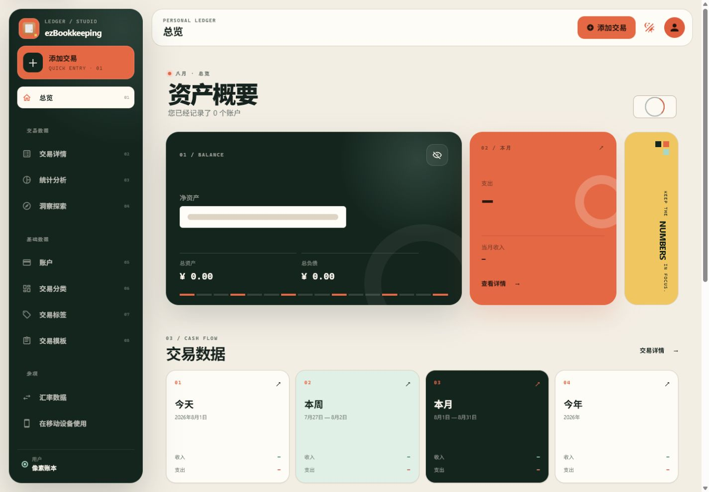
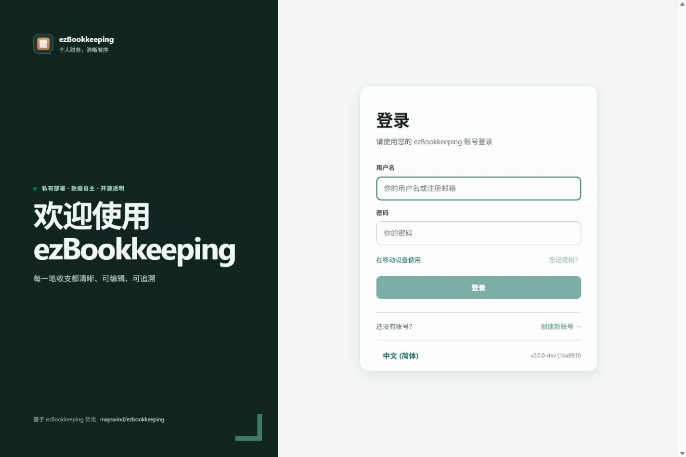
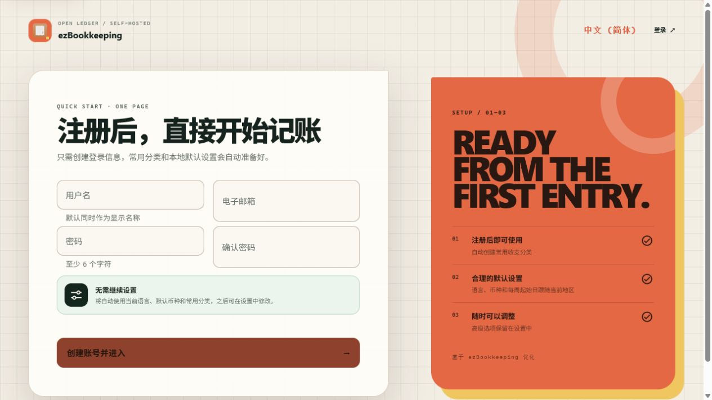
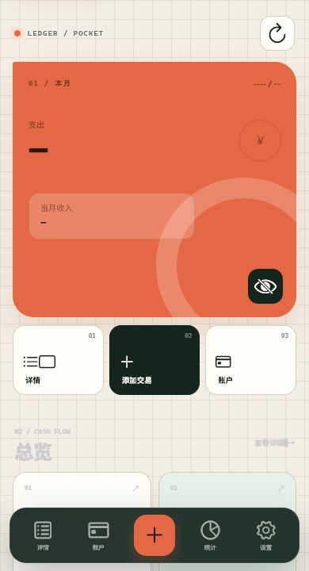

# ezBookkeeping Pixel

[](LICENSE)
[](https://github.com/Panda-995/ezbookkeeping-pixel/actions/workflows/publish-container.yml)
[](https://github.com/Panda-995/ezbookkeeping-pixel/pkgs/container/ezbookkeeping-pixel)

这是一个基于 [mayswind/ezbookkeeping](https://github.com/mayswind/ezbookkeeping) 的独立社区优化版本。原项目、原始业务能力与文档由 MaysWind 开发和维护；本仓库保留 MIT License 与原作者版权声明。本版本并非上游官方发行版。

本次重构主要补充：

- 完整重构桌面端、移动端、登录注册页和公共组件；保留像素识别度，但移除旧版插画、全屏网格与密集硬阴影。
- 账户、子账户余额和交易的明确编辑入口，补齐空状态快捷操作。
- MCP 对账户、余额、交易、分类、标签、标签组的完整认证 CRUD。
- 金额调整通过“余额修改交易”留痕，不直接篡改账户余额。
- 交易支持标签、附件、隐藏金额、地理位置与批量 REST 操作。
- 可复用 Agent Skill，以及 PowerShell / Shell API 命令脚本。
- Docker Compose、完整环境变量清单、SQLite 持久化、健康检查。
- GitHub Actions 自动测试并构建公开的 `linux/amd64`、`linux/arm64` 镜像。
- 现有“导入交易”流程兼容原版 ezBookkeeping `v0.1.0` 起导出的 CSV / TSV 数据。
- 注册精简为用户名、邮箱和密码四项（含密码确认）；显示名称、语言、币种、每周起始日和常用分类自动初始化，注册成功后直接进入总览。

## 全新 UI 与默认分类

新版采用“编辑型财务工作台 + 克制像素细节”的整体设计：悬浮深墨色导航岛、暖纸张画布、珊瑚色主操作、非对称资产 Bento 和大字号金额共同建立全新的产品识别。登录、注册和移动端口袋账本均使用独立页面骨架，不再套用原项目的后台模板；同时保留 PWA、滑动返回、下拉刷新、滑动操作、底部导航、快速记账和安全区适配。详细设计令牌、动效、无障碍和响应式规则见 [DESIGN.md](DESIGN.md)。









新用户和“添加默认分类”使用精简后的分类树：

- 支出：餐饮、穿搭、居住、出行、娱乐、教育、通讯、医疗、人情、金融、其他。
- 收入：工资收入、兼职收入、其他收入。
- 转账：一般转账、借贷、其他。
- 不自动创建预设标签；标签保持空白，由用户、Agent 或 MCP 按实际需要创建。

## 导入原版 ezBookkeeping 数据

无需安装迁移插件，也无需使用单独的迁移工具。打开桌面端“交易详情”，点击“导入”，在现有文件类型中选择“原版 ezBookkeeping 数据导出文件”，即可导入原项目导出的 CSV 或 TSV。

兼容范围：

- `v0.1.0–v0.4.1`：自动兼容只有分钟精度的交易时间和旧 `Comment` 备注列。
- `v0.5.0` 及更高版本：兼容当前 `Description`、地理位置、时区、账户币种和标签格式。
- Excel / WPS 重存后常见的首尾空格、斜杠日期、ISO `T` 分隔和小数秒会自动归一化，不再误报“交易时间无效”。
- 兼容收入、支出、转账、余额修改和跨币种转账；导入前仍可在原有预览页面修改账户、分类和标签映射。
- 同一兼容解析器同时用于网页导入、REST API 和 `transaction-import` 命令行操作。

原版 CSV / TSV 导出文件只包含交易及其引用的账户、分类和标签，不包含用户密码、应用设置或交易图片；这是原项目导出格式本身的范围。

## Docker 部署

仓库内的 `compose.yaml` 直接使用已构建好的公开双架构镜像：

```bash
docker compose pull
docker compose up -d --force-recreate
```

浏览器访问 `http://localhost:18088/`。镜像标签固定为：

```bash
docker pull ghcr.io/panda-995/ezbookkeeping-pixel:latest
```

数据通过 `./data` 和 `./storage` 绑定挂载到宿主机，不使用 Docker 命名卷。Compose 已使用 SQLite 绝对路径并关闭本地数据库连接的周期性回收，容器启动时也会检查挂载目录是否可写。完整端口、目录、故障排查、反向代理、备份和 198 个应用环境变量说明见 [DOCKER_DEPLOYMENT.md](DOCKER_DEPLOYMENT.md)。

## MCP 与 Agent

Compose 默认开启 API Token；如需启用 MCP，可在 `compose.yaml` 的 `environment` 中增加 `EBK_MCP_ENABLE_MCP=true`。所有调用仍必须使用当前用户签发的 Bearer Token，并受数据归属和服务层校验约束。

`compose.yaml` 已设置 `pull_policy: always`，每次重建容器都会检查公开仓库中的 `latest`。升级后建议执行上面的 `pull` 与 `--force-recreate` 命令，避免继续运行本机已有的旧镜像。

- MCP 地址：`https://你的域名/mcp`
- REST API：`https://你的域名/api/v1`
- Agent Skill：`skills/ezbookkeeping/`
- 完整接入与安全说明：[MCP_AGENT_GUIDE.md](MCP_AGENT_GUIDE.md)

## 文档导航

- [产品与设计说明](PRODUCT.md)
- [视觉设计系统](DESIGN.md)
- [原项目分析](ORIGINAL_PROJECT_ANALYSIS.zh_CN.md)
- [Docker 部署与环境变量](DOCKER_DEPLOYMENT.md)
- [MCP 与 Agent 使用指南](MCP_AGENT_GUIDE.md)
- [后续功能路线图](FUTURE_FEATURES.md)
- [来源与署名](ATTRIBUTION.md)
- [原项目中文文档](https://ezbookkeeping.mayswind.net/zh_Hans/)

## 本地验证

```bash
npm ci
npx vue-tsc --noEmit
npx eslint .
npm test
npm run build
go test ./...
```

## 许可证

使用 MIT License。详细来源、修改范围和非官方声明见 [ATTRIBUTION.md](ATTRIBUTION.md)。
